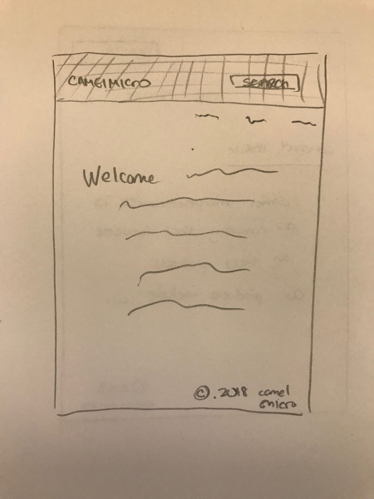
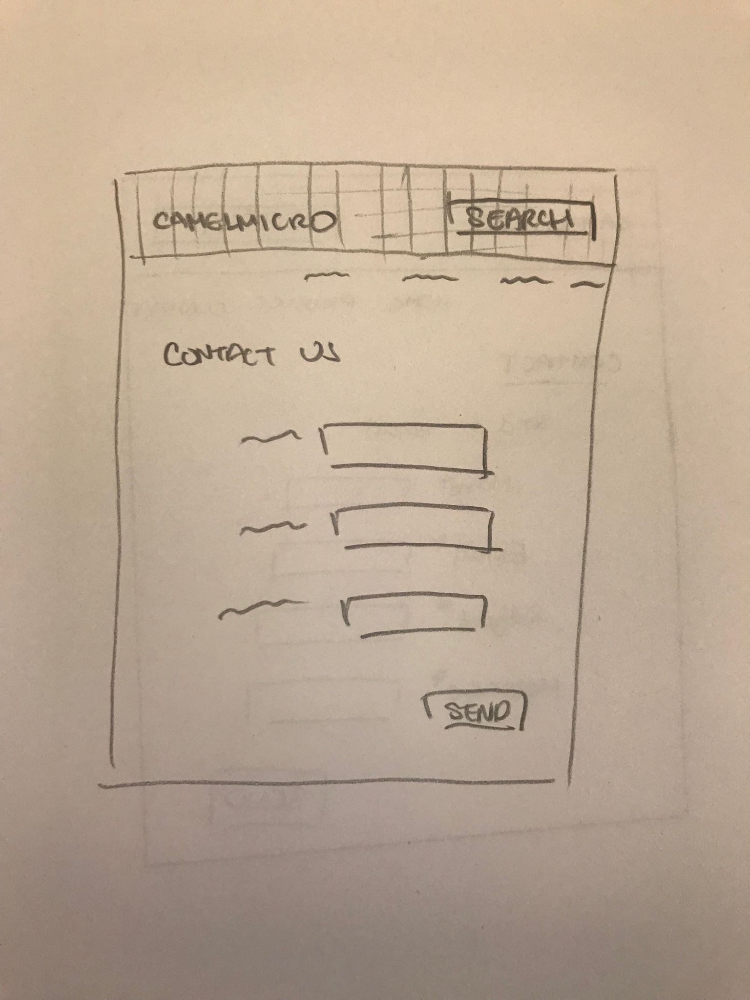
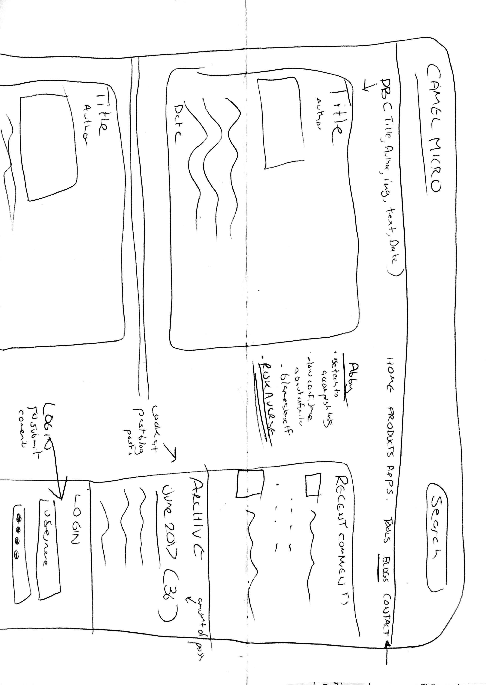
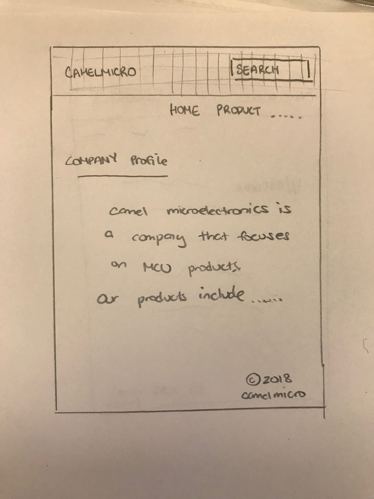
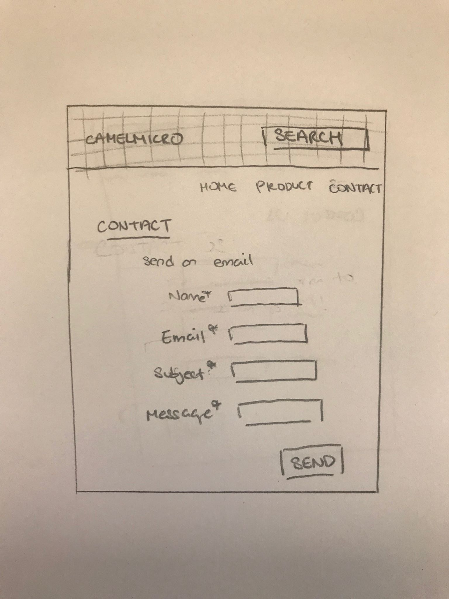
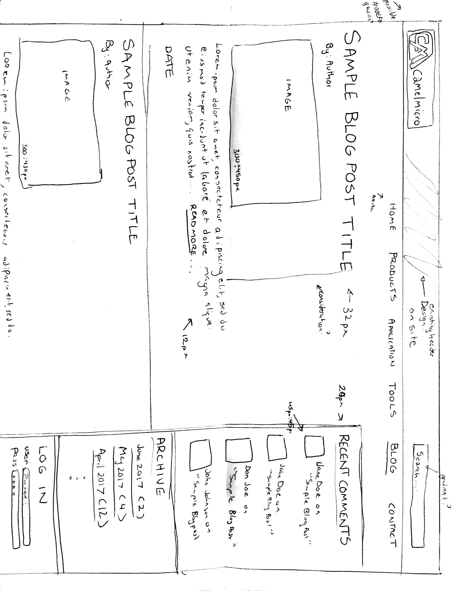

# Project 4 - Design & Plan

Your Team Name: Green Lion

## Milestone 1, Part II: Client Selection

### Client Description

Camel Micro:
Camel microelectronics is a fabless integrated circuit design company with focus on 32bit  MCU(micro-controller unit) products for medical, industrial automation, instrument, automotive, electronic and IoT (Internet of Things) devices.  Camel microelectronics is headquartered in Shanghai, China. Camel microelectronics also has R&D center in silicon valley, USA.  Camel microelectronics provides, world class performance, quality and cost, 32bit MCU solutions to medical appliance, advanced motor control, industrial automation, and IoT devices.

## Milestone 1, Part III: Client Requirements

### Target Audience(s)

The users are engineer and marketing person. The most place they interact with the website would be the blog section.


### Purpose & Content

The purpose of the website is to tell people who we are and what we do.

### Needs and Wants

This website tells our customer or potential customer who we are and what our products can do. It also serve as an information center that user can find technical documents to help them use our products, and exchange ideas with engineers of our company and other users.

* Needs/Wants
  * **Needs and Wants** (What does your client and audience need and want?)
    * Search bar for technical documents
    * Information center
    * Exchange ideas with engineers and other users
    * Chinese version of this website
  * **Design Ideas and Choices** (How will you meet those needs and wants?)
    * We will probably use a form for search
    * the blog post will allow for exchange of ideas with users
    * We will be using google translate to help make a Chinese version of the website. We will have a toggle button on the home page. If users pick Chinese Version we will link them to a new set of links on the navigation bar that leads to Chinese pages.

  * **Memo** (Justify your decisions; additional notes.)
    * We will be using a form for search as we did before.
    * The blog post is due to the request of the client and it also helps us implement the login and upload functions.
    * The Chinese toggle is at the request of the client and it using different a-href links in general rather than having an option to translate each page individually because it would be confusing for users to have to find the translate button on each page. In general, if they want one page translated, each page would be.

### Hosting Plan


[What is your plan for hosting your client's website?]

We will host the website on Heroku.

### Client's Edits

**Yes** they will edit the site, we will send them our files so they can edit the code and content themselves.

### Information Architecture, Content, and Navigation

Example:
* Content #1
  * **Main Navigation** (List your site's navigation here.)
    * Home
    * Products
    * Applications
    * Blogs
    * Contact
  * **Sub-Categories** (List any sub-categories of under the main navigation.)
    * N/A
  * **Content** (List all the content corresponding to main navigation and sub-categories.)
    * *Home*: Intro to company and company profile
    * *Products*: Description of their products which are computer chips
    * *Application*: Instruction for how to use your product
    * *Blogs*: Log in/ Log out to comment and add blog entries, list of all blog entries
    * *Contact*: Form for contact, other contact information

### Interactivity
* Log in and Log out to upload a blog and to comment.
* Commenting
* Send in contact form

Target audience wants to see reviews for products; log in and log out gives credibility to the source of the reviewers
Audience can use contact form to ask questions

### External Code

* Cookie
* Javascript

Cookies will only be used for 3-5% of the project. The rest will be our own code.

### Scale

6 pages, 10 hours per page.

## Milestone 1, Part IV: Work Distribution
1. April: Communicating with client for their wants and Needs (deadline: 4/17/2018)
2. Together draw wireframes (deadlines: 4/23/2018)
3. Work on includes together in person (deadline: 4/25/2018)
  * Header - Navigation bar + Toggle button
      * Search option in the header
  * Footer - Company Logo
  * Init - Pages information
4. We will each do a page of the website - just code and implementation; no design
  *  Iris
     * Home
        * Description of the website
        * Toggle button for translation
     * Contact Us
        * Form that automatically sends email out to company with information provided on the form
  *  April
    * Product
       * Description of the product with image gallery
  * PJ
    * Blog
      * Upload for files and comments
      * log in / log out function
  * Aaliya
    * Application
      * Image gallery with links to each application of the product the client wants.

    Internal deadline for these pages: 5/1/2018

4. Work on CSS together (deadlines: 5/5/2018)


## Milestone 1, Part V: Additional Comments

Subject to change due to client requests.


## Milestone 2, Part I: PHP Interactivity

[Describe here what you plan to do for your PHP Interactivity requirement.]

* Contact form

* Blog Upload Form

* Search

## Milestone 2, Part II: Sketches, Navigation & Wireframes

### Sketches






### Navigation

[What will be your top-level pages and your sub-pages for those top-level pages? What will your website's navigational structure?]

[Tip: If you use card sorting for your navigation, show us that work by including a picture!]

Example:
* Home
* Products
* Application
* Blog
* Contact

### Wireframes






## Milestone 2, Part III: Evaluate your Design

[Use the GenderMag method to evaluate your wireframes.]

[Pick a persona that you believe will help you address the gender bias within your design.]

I've selected **Abby** as my persona.

I've selected my persona because the intricacies of Abby's motivations, attitudes, and her style of learning motivate me to reflect her needs into a fully functional webpage that reflects those desires. I want to engage on Abby's comprehensive information processing style and her aversive attitude to reformat the current CamelMicro Site. I want to engage and immerse her abilities and needs fully by using a model of a responsive, simple, and logic driven site about Camel Micros's products. I also want to reflect these styles and processes into a  page that employs the server side technologies already learned into a logic driven site that Abby is able to use seamlessly.

### Tasks

[You will need to evaluate at least 3 tasks (known as scenarios in the GenderMag literature). List your tasks here. These tasks are the same as the task you learned in INFO/CS 1300.]

[For each task, list the ideal set of actions that you would like your users to take when working towards the task.]

Task 1: [describe your task]

  1. [action 1...]
  2. [action 2...]
  3. ...

Task 2:

Task 3:

### Cognitive Walkthrough

[Perform a cognitive walkthrough using the GenderMag method for all of your Tasks. Use the GenderMag template in the <documents/gendermag-template.md> file.]

#### Task 1 - Cognitive Walkthrough

[copy the GenderMag template here and conduct a cognitive walkthrough to evaluate your design (wireframes).]

[You may need to add additional subgoals and/or actions for each task.]

#### Task 2 - Cognitive Walkthrough


#### Task 3 - Cognitive Walkthrough


### Cognitive Walk-though Results

[Did you discover any issues with your design? What were they? How did you change your design to address the gender-inclusiveness bugs you discovered?]

[Your responses here should be very thorough and thoughtful.]

## Milestone 2, Part IV: Database Plan

### Database Schema

[Describe the structure of your database. You may use words or a picture. A bulleted list is probably the simplest way to do this.]

Table: accounts
* field 1: id NOT NULL PK AUTOINCREMENT
* field 2: username NOT NULL
* field 3: password NOT NULL

Table: blogs
* field 1: id NOT NULL PK AUTOINCREMENT
* field 2: username NOT NULL
* field 3: title NOT NULL
* field 4: text NOT NULL
* field 5: image

Table: contact
* field 1: id NOT NULL OK AUTOINCREMENT
* field 2: username NOT NULL
* field 3: email NOT NULL
* field 4: timestamp NOT NULL
* field 5: text NOT NULL


### Database Queries

[Plan your database queries. You may use natural language, pseudocode, or SQL.]

## Milestone 2, Part V: Structure and Pseudocode

### Structure

[List the PHP files you will have. You will probably want to do this with a bulleted list.]

* index.php - main page.
* includes/init.php - stuff that useful for every web page.
* TODO

### Pseudocode

[For each PHP file, plan out your pseudocode. You probably want a subheading for each file.]

#### includes/init.php

```
messages = array to store messages for user

// DB helper functions (you do not need to write this out since they are provided.)

db = connect to db

pages = associative array with php file to page title

...

```

#### includes/header.php

```
header - logo + design

navbar - for each page in pages show a-href links

```

#### index.php

```
Pseudocode for index.php...

include init.php

include header.php


```


## Milestone 2, Part VI: Additional Comments

[Add any additional comments you have here.]


## Milestone 3: Updates

[If you make any changes to your plan or design, make a list of the changes here.]


## Milestone 4: Updates

[If you make any changes to your plan or design based on your peers' feedback, make a list of the changes here.]


## Milestone 5: Cognitive Walkthrough

[Copy your tasks here from Milestone 2. Update them if you need to and then conduct another cognitive walkthrough.]

### Cognitive Walk-though Results

[Did you discover any issues with your design? What were they? How did you change your design to address the gender-inclusiveness bugs you discovered?]

[Your responses here should be very thorough and thoughtful.]

## Milestone 5: Final Notes to the Clients

[Describe in some detail what the client will do (or would have to do) in order to make this website go live. What is the deployment plan?]

[Include any other information that your client needs to know about your final website design. For example, what client wants or needs were unable to be realized in your final product? Why were you unable to meet those wants/needs?]

## Milestone 5: Final Notes to the Graders

[1. Give us three specific strengths of your site that sets it apart from the previous website of the client (if applicable) and/or from other websites. Think of this as your chance to argue for the things you did really well.]

[2. Tell us about things that don't work, what you wanted to implement, or what you would do if you keep working with the client in the future. Give justifications.]

[3. Tell us anything else you need us to know for when we're looking at the project.]
